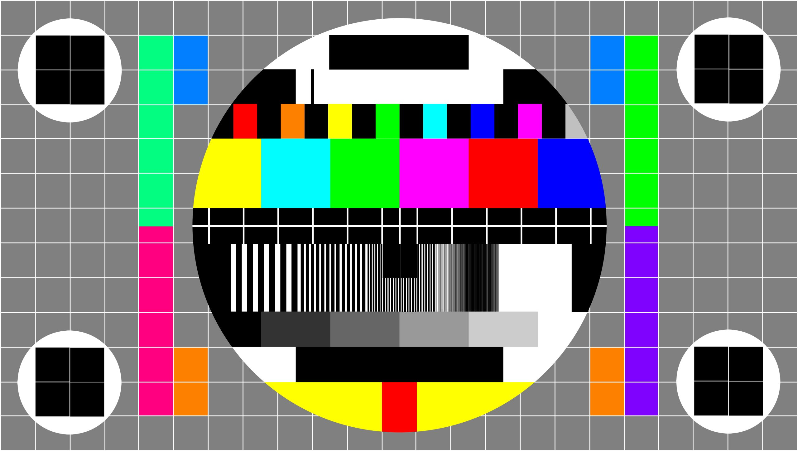

## 📀 Gerald Perlas – DVD Menu Portfolio Website

A uniquely styled, retro DVD menu-inspired portfolio showcasing creative work in **video editing**, **photography**, **motion graphics**, and **graphic design**.



---

### 🚀 Live Demo

👉 [Visit Portfolio](https://geraldperlas.com)

---

### 🧰 Tech Stack

- **Frontend**: HTML, Tailwind CSS, JavaScript
- **Build Tools**: Vite, PostCSS, TypeScript
- **Deployment**: GitHub Pages
- **Database (Optional)**: Drizzle + Neon for dynamic content

---

### 🧾 DVD Menu Structure

| Menu Item          | Purpose                             |
|--------------------|--------------------------------------|
| **PLAY**           | Highlights reel (embedded video)     |
| **SCENE SELECTION**| Gallery of portfolio projects        |
| **LANGUAGES**      | Tools & software proficiency         |
| **SPECIAL FEATURES** | About Me, Behind-the-Scenes        |

---

### 📁 File Tree Overview

```
geraldperlas.com-main/
├── index.html
├── assets/
│   ├── style.css
│   ├── script.js
│   └── media/             # Your custom media goes here
├── attached_assets/
│   └── background.jpg     # Visual theme assets
├── README.md              # This file
├── CUSTOMIZATION_GUIDE.md
└── deploy-instructions.txt
```

---

### 🖼️ Customizing Your Portfolio

1. **Replace media in**: `assets/media/`
2. **Edit project data in**: `assets/script.js`
3. **Adjust layout/style in**: `assets/style.css`

> Refer to the [`CUSTOMIZATION_GUIDE.md`](./CUSTOMIZATION_GUIDE.md) for detailed instructions.

---

### 💻 Local Development

```bash
npm install
npm run dev
```

### 🔧 Build for Production

```bash
npm run build
```

---

### 🌐 Deploying to GitHub Pages

See `deploy-instructions.txt` or follow this summary:

1. Upload the `build/` folder contents to your GitHub repo.
2. Enable GitHub Pages via the **Settings > Pages** tab.
3. Set source to `main` branch and `/ (root)` folder.

---

### ✍️ License

MIT — Feel free to remix, modify, and share.
